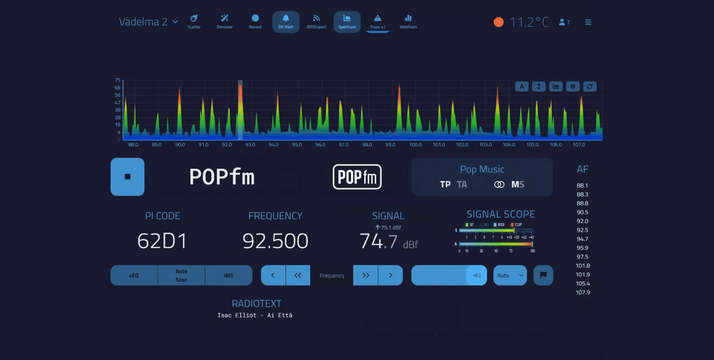

# Signal Scope for FM-DX-Webserver


[](https://buymeacoffee.com/jannedx)





Signal Scope is a modern RF signal and audio modulation meter plugin for FM-DX-Webserver.

It combines broadcast-style metering, stereo/RDS indicators and customizable visual themes into a lightweight native-looking plugin.

## Features

- Real-time RF signal meter
- Real-time audio modulation meter
- Peak hold indicators
- Stereo / Mono / RDS / CLIP LEDs
- Smooth LED fade animations
- Multiple meter styles
- Theme system
- Optional glass panel effect
- Optional live meter value text
- Optional Activity Strip visualization
- CRT-inspired visual atmosphere
- Scanline and phosphor effects
- Stereo/RDS shimmer effect
- Weak signal RF sparkles
- Native FM-DX-Webserver visual integration
- Compact and lightweight
- Mobile friendly
- Mini / Normal / XL panel sizes
- Settings popup UI
- Update notification support

## Meter Styles

- Classic
- Segmented
- LED
- Thin
- Neon

## Themes

- Webserver Theme
- Matrix Green
- DX Green
- Amber Orange
- Arctic Cyan
- Nightwish Purple
- Crazy Citrus

## Installation

1. Download the latest release ZIP
2. Extract the `SignalScope` folder
3. Copy the folder into your FM-DX-Webserver plugins directory
4. Restart FM-DX-Webserver
5. Enable the plugin from Plugin Management

## Settings

Signal Scope includes a built-in settings popup accessible from the gear icon.

Current settings:

- Theme selection
- Meter style selection
- Glow intensity
- Peak Hold speed
- Value text
- Activity Strip
- Glass panel mode
- Panel size

Settings are stored locally in browser localStorage.

## LocalStorage Keys

```js
SIGNAL_SCOPE_THEME
SIGNAL_SCOPE_METER_STYLE
SIGNAL_SCOPE_GLOW
SIGNAL_SCOPE_GLASS
SIGNAL_SCOPE_SIZE
SIGNAL_SCOPE_PEAK_DECAY
SIGNAL_SCOPE_VALUE_TEXT
SIGNAL_SCOPE_ACTIVITY_STRIP
```

Example:

```js
localStorage.setItem('SIGNAL_SCOPE_THEME', 'matrixGreen');
localStorage.setItem('SIGNAL_SCOPE_METER_STYLE', 'neon');
location.reload();
```

## Supported Themes

```txt
webserver
matrixGreen
dxGreen
amberOrange
arcticCyan
nightwishPurple
crazyCitrus
```

## Supported Meter Styles

```txt
classic
segmented
led
thin
neon
```

## What's New

v0.6.0

This release introduces the new Activity Strip system and major visual atmosphere enhancements inspired by broadcast instrumentation and CRT-style signal monitoring.

New:
- Activity Strip visualization
- CRT-style atmospheric rendering
- Ultra subtle scanline overlay
- Phosphor persistence glow
- Stereo/RDS shimmer effect
- Weak signal RF sparkle effects
- Audio peak pulse response
- Dynamic movement based on signal conditions
- Activity Strip settings toggle

Improved:
- Neon meter appearance
- Mobile Safari rendering
- Glow rendering consistency
- Meter animation smoothness
- Broadcast-style visual depth
- Overall UI polish and visual atmosphere

v0.5.4

This release focuses on UI polish, mobile refinement and overall visual consistency.

Changes:
• New optional value text display
• Cleaner and calmer settings UI
• Improved mini/mobile layout
• Refined glass panel appearance
• Better meter spacing and alignment
• Smoother LED fade behavior
• Internal cleanup and polish

v0.5.3
 
- Glow intensity modes
- Peak Hold speed control
- Glass panel mode
- Mini / Normal / XL panel sizes
- Smooth LED fade animations
- Improved settings panel UI
- Neon and segmented meter improvements
- Better theme transitions
- Enhanced visual polish

Improved:
- Meter rendering performance
- Peak hold visibility
- Theme persistence
- Responsive layout handling


## Roadmap

### v0.6.x

- DX Storm visual mode
- Optional analog CRT drift
- Optional spectrum pulse effects
- Vertical compact mode
- Advanced shimmer profiles

## Future Ideas

- Vertical mode
- Retro tuner skin
- Analog needle mode
- Oscilloscope waveform mode
- Stereo image meter
- RF turbulence visualization
- Broadcast rack mode

## Credits

Special thanks to the FM-DX-Webserver community for ideas, testing and feedback.

## License

MIT License

## Author

Janne Heinikangas / JanneDX
Developed in Finland 🇫🇮

GitHub:
https://github.com/fmatic/SignalScope
